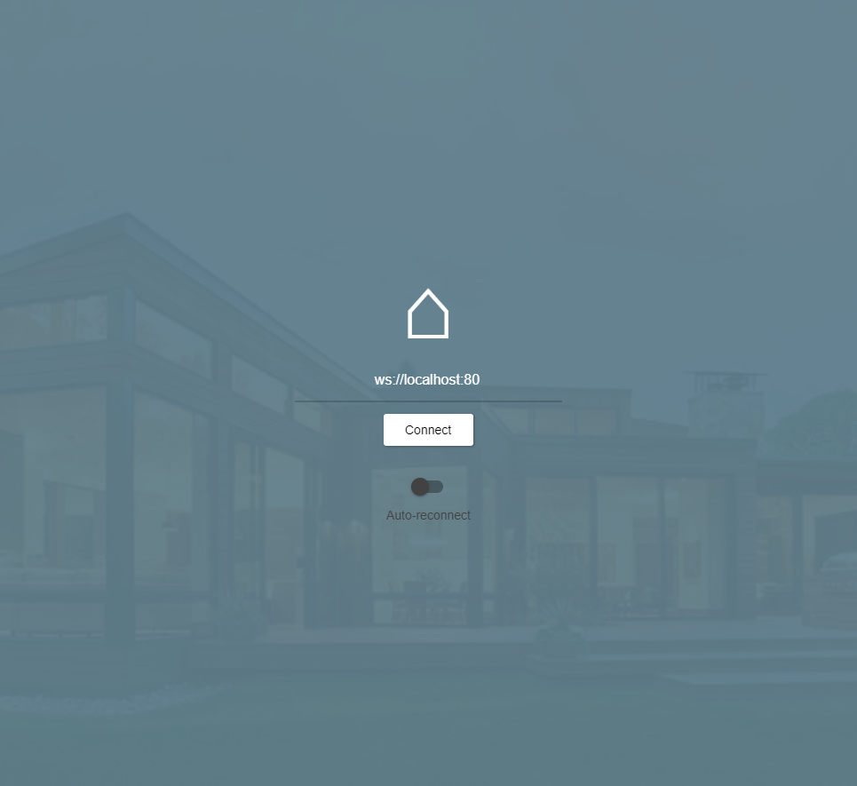
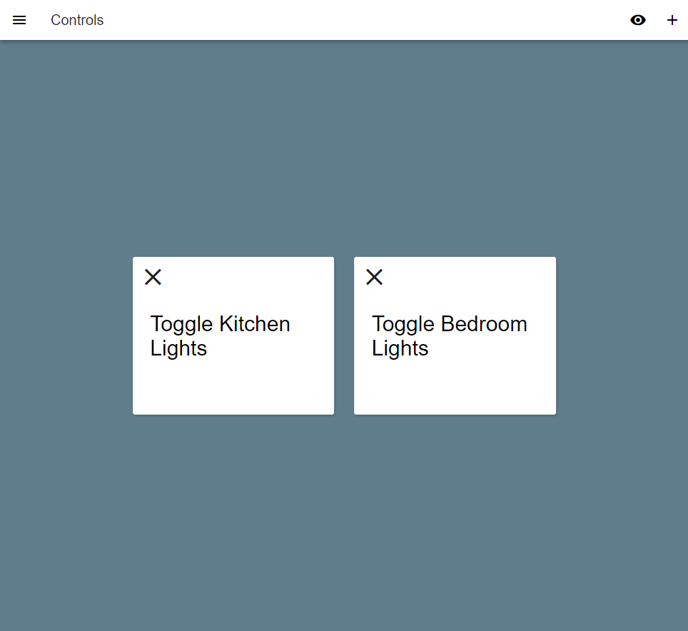
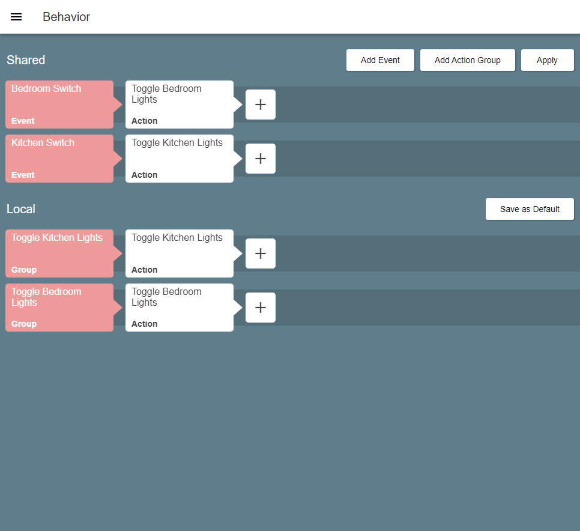
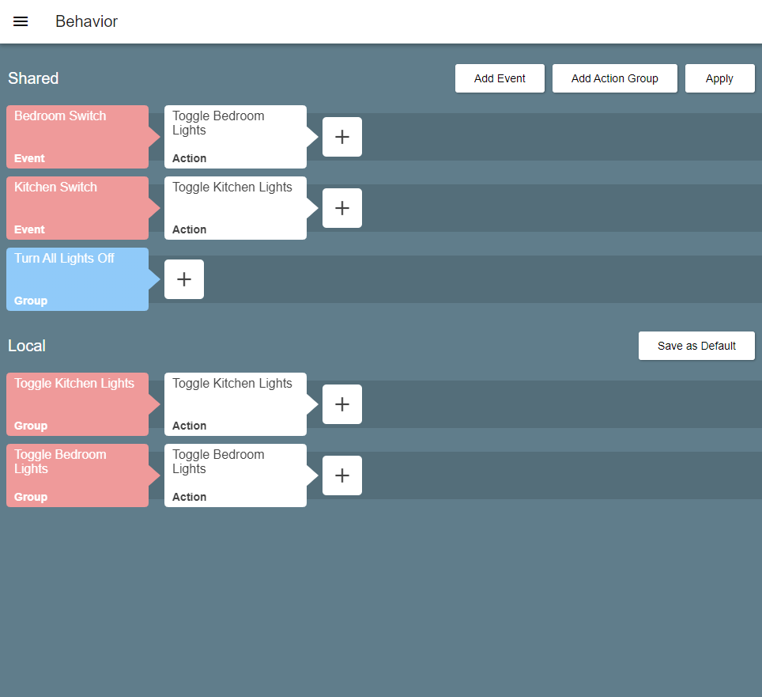
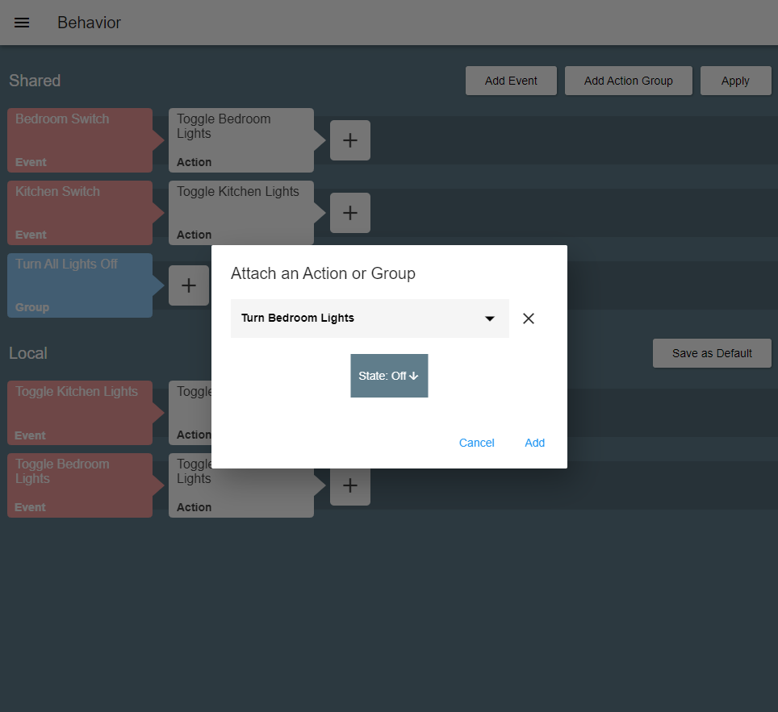
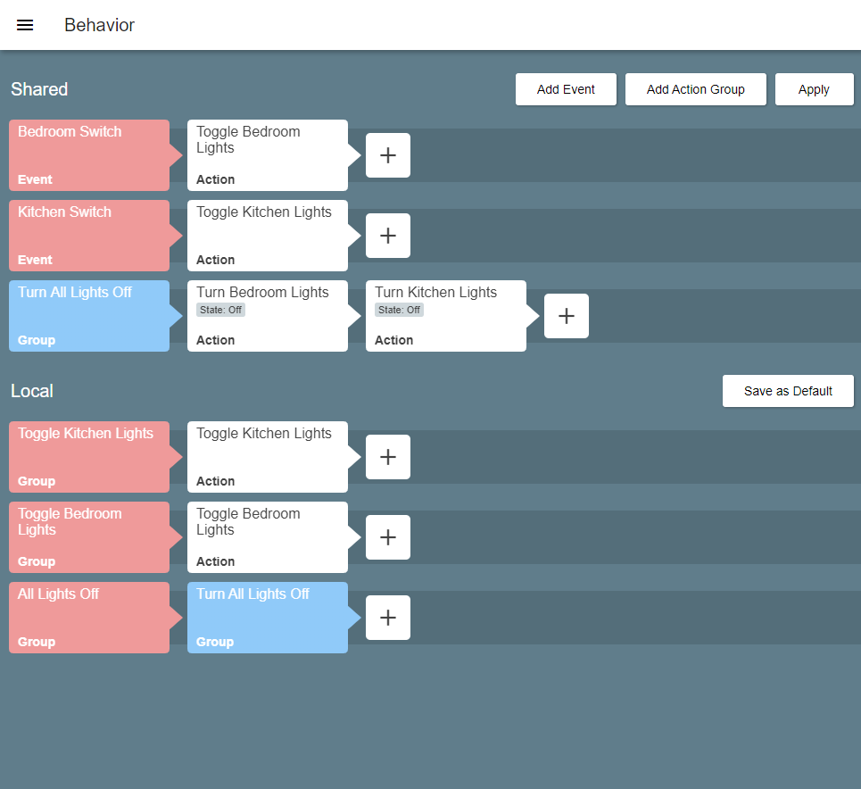

# Smart Home Pad

A simple smart home behavior configurator.

# Installation

## Installing the server

Smart Home Pad server requires Node.JS runtime and can run on any machine supporting [Node.JS](https://nodejs.org/en/), including Raspberry Pi (Zero W). There are virtually no minimum hardware requiremets except TCP/IP connectivity.

The server is the *brain* of the system and should run continually in an ideal scenario.

Go to the [Releases](https://github.com/kasp1/smarthome-pad/releases) page and download `smarthome-pad-server.zip` from the latest release. Unzip it anywhere on your target machine and start it with Node.JS:

```
node main.js
```

## Installing the Pad

Smart Home Pad is the configuration user interface for Smart Home Pad server.

Go to the [Releases](https://github.com/kasp1/smarthome-pad/releases) page and download `smarthome-pad.zip` from the latest release.

Unzip it under any web server and you are good to go. Smart Home Pad requires no server side script environments.

> Tip: you can also unzip `smarthome-pad.zip` under the server's `/ui` folder, you can then access it from your browser on your server's IP.

# Usage

## Logging into a Pad

Once you have your Pad installed, open your browser and type the address of your server, the Pad UI should load:



Here you can input the address of the server side or leave it as-is in case the UI is being loaded from the server side.

**Auto-reconnect** is an option for displays dedicated to Smart Home Pad. For example if you want to have a display integrated in a wall that should be constantly displaying the Smart Home Pad, you can check this option and the UI will automatically try reconnect to the filled address on reload (e.g. if your display device restarts on power shortage).

Next click the **Connect** button.

## Behavior setup

Once you connect to a server, you should see the **Controls** screen.



This screen is dedicated to virtual buttons to control your system. Imagine you wanted to have a few Pad screens integrated in walls around your house (to make it really cool 😜). Each of these screens would have their own virtual buttons to say toggle lights in their given room.

> Tip: The Pad UI is responsive and touch-friendly, so can be run on any kind of touch display.

Here we are speaking **Local** behavior, which is specific to a single display/browser the Pad UI is running in.

You can create any number of buttons using the `+` icon at the top right corner. Delete buttons by clicking/tapping the `✖` mark on each.

> Tip: if you really want to put the Pad UI on your wall, you can take advantage of *clean mode*. Tap the *eye* icon in the top right corner of the screen to make the UI clearner. You can turn off *clean mode* from the menu (pull out from left edge of the screen).

# Setting up local behavior

When you are done setting up your virtual buttons, head to the menu (the hamburger button top left, or pull it out from the left edge) and select **Behavior**.

When you get to the **Behavior** screen, you should see two sections: **Shared** and **Local**. These are two types of behavior you can set up for your system.



The **Local** section is where you set up what happens when you tap/click your virtual buttons from the **Controls** screen. You can see each of your buttons is represented by red rectangle. Virtual buttons and **Local** behavior is specific to each screen/browser the Pad UI is running on. While **Shared** behavior is used for physical triggers (like a real physical button). No matter what device do you open the Smart Home Pad from, the **Shared** behavior will be the same.

Red rectangles are **Events**. Each **Event** start a line of **Actions** to happens when triggered (e.g. when you tap that virtual or physical button).

**Actions** and **Shared events** come from software modules bound with your server. They are pre-defined and you can define your own custom modules. Please follow the sections below for more information.

**Shared Events** can be added using the **Add Event** button.

**Actions** can be added to **Events** using the `+` button in each **Event**'s row.

You can also utilize group of actions when your behavior definition becomes too crowded. Select the **Add Action Group**, give the group a name and you should see it in the **Shared** behavior section, for example:



Some actions come with parameters that can be set up when adding action. For example here we have an action to *turn lights* into a *state* (parameter) and we can choose either *On* or *Off*:



If we add such action into our **Turn All Lights Off** group for each lights, we can now create a virtual button called **All Lights Off** and attach this group to its **Event** (using the `+` button):



⚠ **SUPER IMPORTANT** In order the reflect your changes to the **Shared** behavior on the server, you need to press the **Apply** button every time you are done editing.

> Tip: The **Save as Default** button saves your current **Local** setup to the server and next time you are opening the Pad UI on a new device, the default **Local** behavior setup will be loaded automatically.

Any actions or groups can be easily deleted. Just long press on each and drag it on the bin icon which appears in the top right corner of the screen.

## Creating modules

Each module is Node.JS/JavaScript file under the `/modules` directory (server side). There is a simple API to expose **Shared Events** and **Actions**:

```javascript
let module = {
  // module title for the UI
  title: 'Light Controls',

  // Example events this module may emit
  events: ['BedroomSwitch', 'KitchenSwitch'], 

  // what happens after the module is loaded
  start () {

  },
  
  // example actions that this module may expose
  actions: {
    turnKitchenLights: {
      // optional: action parameters
      params: {
        // name: array of possible values or empty string
        // (empty string will allow the user to input a string)
        state: ['On', 'Off']
      },
      // what happens when the action is called
      async handler (_this, params) {
        // `params` may contain:
        // { state: 'Off' }
      }
    },
  }
}

export default module
```

Check out the `server/module_examples` directory.