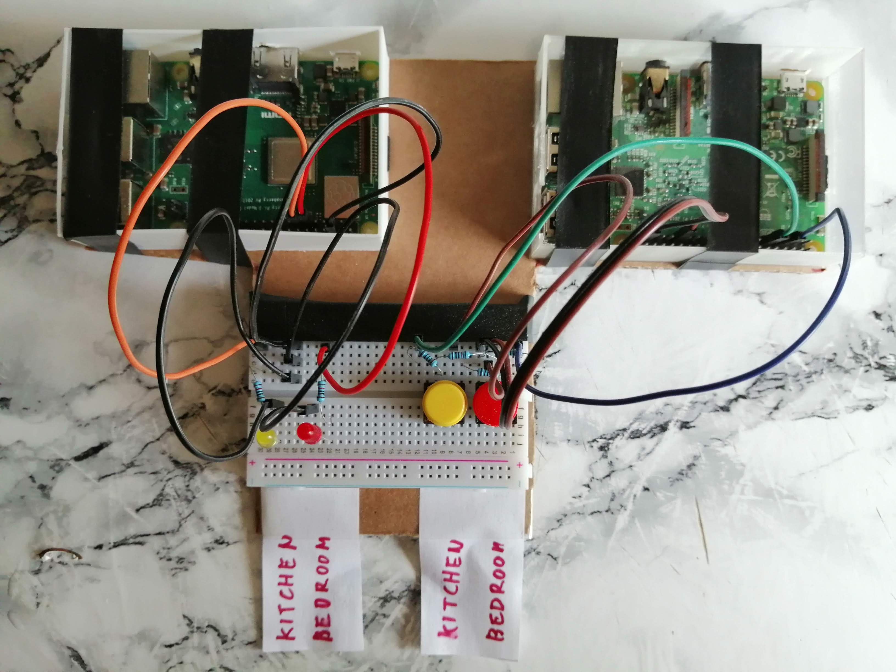

# Light and Switch Sample Module

[](https://www.patreon.com/bePatron?u=5743048)

This is an example if two lights (Bedroom and Kitchen lights) being controlled by the SmartHome Pad and also two hardware light switches controlling these buttons.

### Step 1: Get your SmartHome Pad server running.

Please follow the instructions in the main [README](https://github.com/kasp1/smarthome-pad).

### Step 2: Install the example modules

Copy the two files in this directory (`buttons0.js` and `lights0.js`) into your smartHome Pad Server's `modules/` directory.

You can see that these two modules use TCP/IP to connect to their hardware counterparts. This is just an example, you can use any protocol you prefer.

If you restart the SmartHome Pad Server at this point, you should see in the console that the modules are repetitively trying to connect to their hardware counterparts.

### Step 3: Set up your module hardware conterparts

I have used Raspberry Pis for each hardward module (one for the lights, one for the buttons). The RPIs were connected to my router over Wi-Fi and so was the SmartHome Pad Server. If you use the same approach, please make sure to update the IP addresses in `modules/buttons0.js` and `modules/lights0.js`.

Pardon this image, I'll just choke it here until I (or a contributing hero) find time to create a proper connection scheme.



If something is unclear, there's more photos in this directory, please have a look.


### Step 4: Run the code below on each of your corresponding hardware modules

I chose Node.js to program my hardware module counterparts, but you can choose any language you wish.


## Sample Lights Raspberry Pi Hardware Module

This module is using LED lights, but you could easily swap the LEDs with a relays to control actual lights.

**package.json**
```json
{
  "name": "smarthome-sample-lights",
  "version": "0.0.1",
  "description": "",
  "main": "main.js",
  "scripts": {
    "test": "echo \"Error: no test specified\" && exit 1"
  },
  "author": "",
  "license": "ISC",
  "type": "module",
  "dependencies": {
    "onoff": "^6.0.0",
    "pigpio": "^3.2.3",
    "ws": "^7.3.0"
  }
}
```

**main.js**
```node
import net from 'net'
import Gpio from 'onoff'

const PORT = 5081;

let gpio = Gpio.Gpio

let led = {
  1: new gpio(17, 'out'),
  2: new gpio(27, 'out')
}

let state = {
  1: 0,
  2: 0
}

// start communication
let server = net.createServer((socket) => {
  console.log('Incoming connection.')

  // message from a client may contain only 1 or 2
  socket.on('data', (data) => {
    let code = parseInt(data)

    switch (code) {
      case 1: toggleRelay(code)
        break
      case 2: toggleRelay(code)
        break
      case 3:
        led[1].writeSync(1)
        state[1] = 1
        break
      case 4:
        led[1].writeSync(0)
        state[1] = 0
        break
      case 5:
        led[2].writeSync(1)
        state[2] = 1
        break
      case 6:
        led[2].writeSync(0)
        state[2] = 0
        break
    }
  })

  // remove disconnected clients from our array of connections
  socket.on('error', () => { })
})

server.listen(PORT)

console.log('Lights controller running @', PORT)


function toggleRelay(id) {
  console.log('Toggling relay', id)

  state[id] = (state[id] == 1 ? 0 : 1 )
  led[id].writeSync(state[id])
}
```


## Sample Light Switch Raspberry Pi Hardware Module

**package.json**
```json
{
  "name": "smarthome-sample-controller",
  "version": "0.0.1",
  "description": "",
  "main": "main.js",
  "scripts": {
    "test": "echo \"Error: no test specified\" && exit 1"
  },
  "author": "",
  "license": "ISC",
  "type": "module",
  "dependencies": {
    "onoff": "^6.0.0",
    "ws": "^7.3.0"
  }
}
```

**main.js**
```node
import net from 'net'
import Gpio from 'onoff'

const PORT = 5082;

let sockets = []

// start communication
let server = net.createServer((socket) => {
  console.log('Incoming connection.')

  sockets.push(socket)

  // remove disconnected clients from our array of connections
  socket.on('error', () => { removeSocket(socket) })
  socket.on('close', () => { removeSocket(socket) })
})

server.listen(PORT)

console.log('Light controls running @', PORT)

// sends a message to all connected clients
function send(data) {
  sockets.forEach((socket) => {
    socket.write(data)
  })
}

function removeSocket(socket) {
  sockets.splice(sockets.indexOf(socket), 1)
}

// read physical button presses and dispatch events

let gpio = Gpio.Gpio

const button1 = new gpio(4, 'in', 'both')
const button2 = new gpio(17, 'in', 'both')

button1.watch((err, value) => {
  console.log('Button 1 pressed')
  send('1')
})

button2.watch((err, value) => {
  console.log('Button 2 pressed')
  send('2')
})
```
